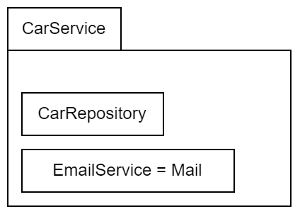
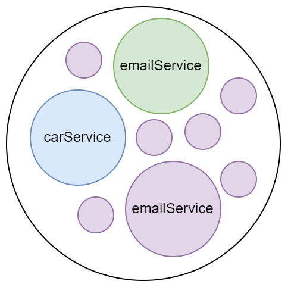

+++ 
draft = false
date = 2024-01-26T03:08:36+03:00
title = "Dependency Injection"
description = ""
slug = ""
authors = ["Никита Гармоза"]
tags = []
categories = []
externalLink = ""
series = []
+++

**DI** (Dependency Injection principle) - это специализированная форма **IoC** (IoC - Inversion of Control principle), при которой объект (или функция) получает свои зависимости через (а не создает их внутри себя):

- Аргументы конструктора или фабричного метода
- Установление свойств объекта, после его создания (через сеттеры)

### Благодаря этому

- **Создание объектов разделяется от их использования**, тем самым ослабляя связь между объектами.
- Приложение (объекты) могут использовать **различные конфигурации**.
- **Разделение ответственностей** - новые изменения не затрагивают других ответственностей.
- Лучшая **тестируемость**.

## Пример

### Без использования DI



```java
public class CarService {
  private CarRepository carRepository = new CarRepository(); // wrong!

  public CarService() {
    this.carRepository = new CarRepository(); // wrong!
  }
}
```

### С использованием DI


```java
public class CarService {
  private CarRepository carRepository;

  public CarService(CarRepository carRepository) {
    this.carRepository = carRepository;
  }
}
```

### Несколько объектов

```java
public class CarService {
  private CarRepository carRepository;
  private EmailService emailService;

  public CarService(CarRepository carRepository, EmailService emailService) {
    this.carRepository = carRepository;
    this.emailService = emailService;
  }
}

public class EmailService {
  private Mail mail;

  public EmailService(Mail mail) {
    this.mail = mail;
  }
}

public class Main {

  public static void main(String[] args) {
    // dependencies
    CarRepository carRepository = new CarRepository();
    Mail mail = new Mail();
    EmailService emailService = new EmailService(mail);

    // inject
    CarService carService = new CarService(carRepository, emailService);
  }
}
```

### Множество объектов `emailService` без использования Singleton



Без использования Singleton-а в больших приложениях могут создаваться **одни и те же объекты**, что приводит к трате памяти (и даже к heap overflow). При этом для работы приложения, нам чаще всего достаточно одного экземпляра. Вывод: **писать Singleton-ы**. В Spring Beans **по умолчанию** являются Singleton-ами.

### Spring DI (+ Singleton by default)

```java
@Component
public class CarService {
  private CarRepository carRepository;
  private EmailService emailService;

  @Autowired
  public CarService(CarRepository carRepository, EmailService emailService) {
    this.carRepository = carRepository;
    this.emailService = emailService;
  }
}
```
