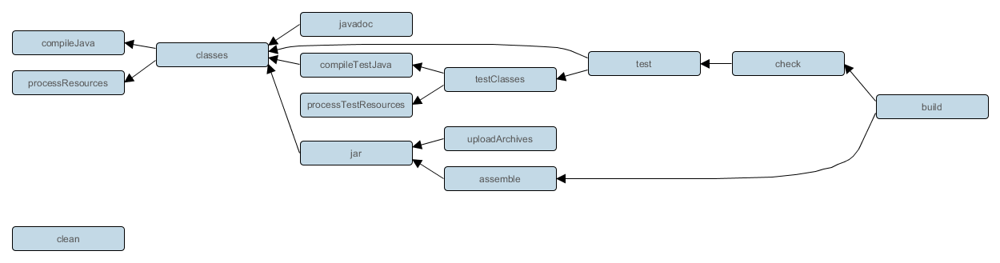

+++ 
draft = false
date = 2024-01-09T14:40:37+03:00
title = "Gradle"
description = ""
slug = ""
authors = ["Никита Гармоза"]
tags = []
categories = []
externalLink = ""
series = []
+++

**Gradle** - автоматизированный сборщик проектов, выполняющий такие цели как

- Компиляция кода.
- Запуск тестов.
- Импортирование зависимостей.
- Создания файлов запуска программы.
- Унификация сборки (приведение к одному стандарту всего того, что выше).

Gradle - является **декларативным** - разработчик только сообщает, что он хочет видеть в результате, но не как добиться этого. Как собрать проект и разрешить зависимости Gradle решает сам (точнее с самого начала работает по общему шаблону). Благодаря этому **местоположение исходных и собранных файлов в проекте зафиксировано**.

### Преимущества над Maven

- От 2 до 10 раз быстрее (по документации).
- Поэтапная сборка (incremental) - соответствующие задачи будут пропущены, если ничего не изменилось.
- Легко добавлять свои плагины, а также шаги для сборки, которые после используются в жизненном цикле.
- Последовательность задач в lifecycle в виде дерева

## Структура проекта

- `build.gradle` - содержит всю конфигурацию необходимую для сборки проекта.

- `settings.gradle` - содержит имя проекта, а также всех подмоделей

- `/build` - файлы, полученные в результате сборки (выполняемые файлы, скомпилированные классы, отчеты тестов и другое).

- `artifact` - выполняемый **jar/war/ear** файл (хранится внутри `/build`).

- `/src/main/java` - основной код программы (по умолчанию).

- `/src/test/java` - тестовый код программы (по умолчанию).

## Структура build.gradle

### Plugins

Плагины отвечают за задачи, которые мы можем использовать.

По умолчанию Gradle не знает с каким языком он работает. Поэтому необходимо

```groovy
plugins {
    id 'java'
}
```

### Координаты проекта

```groovy
group 'com.garmoza'
version '1.0-SNAPSHOT'
```

Имя проекта в `settings.gradle`.

### Версия Java

По умолчанию Gradle использует ту версию JDK, на которой запущен, но можно указать
определенную версию

```groovy
java.sourceCompatibility = JavaVersion.VERSION_1_8
```

Будет использован режим совместимости (compatibility mode).

### Repositories

По умолчанию Gradle не знает откуда брать зависимости, поэтому необходимо показать ему

```groovy
repositories {
    mavenLocal()
    mavenCentral()
    maven {
        url = uri('https://repo.maven.apache.org/maven2/')
    }
    flatDir {
        dirs 'libs'
    }
}
```

Поиск зависимостей осуществляется последовательно

- `mavenLocal` - C:\\User\\\*user\*\\.m2\\repository
- `mavenCentral` - Maven Central
- `maven` - по url
- `flatDir` - локальные файлы

#### Variables

```groovy
def springBootVersions = '2.5.2'

// old version
ext {
    springBootVersions = '2.5.2'
}
```

### Dependencies

```groovy
dependencies {
    implementation "org.springframework.boot:spring-boot-starter-web:$springBootVersions"
    implementation group: "org.springframework.boot", name: 'spring-boot-starter-data-jpa', version: springBootVersions
}
```

#### Dependency scope

**Основной код**


- `compileOnly` - compile stage (lombok, servlet-api) (equivalent of maven _'provided'_).
- `runtimeOnly` - runtime stage (hibernate, postgres, jdbc) (equivalent of _'runtime'_ maven scope).
- `implementation` - accessible both in compile and runtime (equivalent of maven _default_ scope).

Доступность для тестов

- `compileOnly` - not accessible from test.
- `runtimeOnly` - will be accessible in tests runtime.
- `implementation` - accessible in tests (accessible both in compile and runtime).


`compile`, `runtime` устарели, вместо них `compileOnly`, `runtimeOnly`.


**Тестовый код**


- `testCompileOnly` - test compile stage (not in project compile)
- `testRuntimeOnly` - test runtime stage (not in project runtime)
- `testImplementation` - compile + runtime (equivalent of maven _'test'_)


`testCompile`, `testRuntime` устарели, вместо них `testCompileOnly`, `testRuntimeOnly`.


**Области видимости для аннотаций**

- `annotationProcessor` - project annotation processing (except test)
- `testAnnotationProcessor` - annotation processing in tests

**Для библиотек и зависимостей**

- `api` - making dependency available when you writing a library, or importing module
- `compileOnlyApi` - same as api, not found differences

#### Объединение dependency scopes

```groovy
dependencies {
    annotationProcessor "org.projectlombok:lombok:1.18.28"
}

configurations {
    compileOnly.extendsFrom annotationProcessor
    testCompileOnly.extendsFrom annotationProcessor
    testAnnotationProcessor.extendsFrom annotationProcessor
}
```

### Tasks

Каждая задача в Gradle является **объектом** - может быть сконфигурирована, унаследована или создана с нуля.

#### Запуск задачи

```bash
gradle name_of_task
```

- `gradle tasks` - печатает доступные задачи
- `gradle clean` - удалят /build
- `gradle build` - сборка проекта
- `gradle build -x test` - сборка проекта без тестов
- `gradle build --dry-run` - показывает последовательность выполнения
- `gradle projects` - обновляет импорты в settings.gradle

## Gradle lifecycle

Добавляются при помощи плагинов, либо могут быть написаны вручную (например, на Java).

Имеют древовидную структуру. Пропускает задачи, если возможно (уже выполнены, отсутствуют данные).


