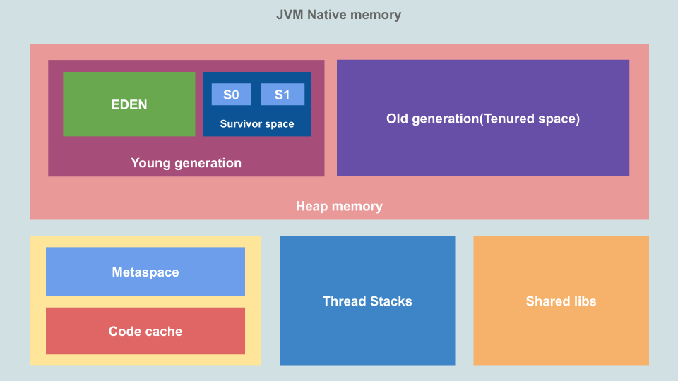

+++ 
draft = true
date = 2024-01-17T17:04:09+03:00
title = "Java Memory Model"
description = ""
slug = ""
authors = ["Никита Гармоза"]
tags = []
categories = []
externalLink = ""
series = []
+++

**RAM** - оперативная память - во время работы компьютера **хранит машинный код программы**, входные, выходные, промежуточные данные,
обрабатываемые процессором.

**ОЗУ** - оперативное запоминающее устройство - **техническое устройство**, реализующие функции оперативной памяти.

## Stack VS Heap

**Stack** - использует **static memory allocation**

- Очень быстрая работа с данными.
- Размер хранимых данных должен быть известен во время компиляции.
- Работает как LIFO, данные хранятся в stack frames.
- Многопоточные приложения имеют свой собственный стек для каждого.
- Управление стеком осуществляется ОС.
- Хранятся локальные переменные, указатели, информацию о функциях.
- В сравнении с Heap память стека ограничена, можем получить stack overflow errors.
- Часто есть ограничения на значения, которые могут храниться в стеке.

**Heap** - использует **dynamic memory allocation**

- Меленее в сравнении со стеком.
- Хранит данные с динамическим размером.
- Обращение к данными по указателям.
- Многопоточные приложения разделяют кучу между потоками.
- Использует автоматическое управление памятью, предоставляемое языками.
- Хранятся глобальные переменные, ссылочные данные - объекты, строки, словари и другие структуры.
- Если выделяемая память кончится, можем получить out of memory errors.
- В общем нет ограничения, на размер значения, которые могут храниться в куче.

## JVM Memory

Структура памяти JVM начиная с **JDK 11**



- **Heap** - здесь JVM хранит объекты и динамические данные
- **Young generation** - хранит новые объекты. За освобождение памяти отвечает **Minor GC**.
- **EDEN** - сюда объекты попадают сразу после создания.
- **Survivor space** - хранит объекты, оставшиеся после работы Minor GC. Состоит из двух частей: **S0** и **S1**.
- **Old generation** - хранилище, в которое попадают объекты из Young generation при достижении порога хранения. За освобождение памяти отвечает **Major GC**.
- **Thread Stacks** - место под стеки потоков. Используется для хранения статичных данных, в том числе фреймов методов, указатели на объекты.
- **Metaspace** - для хранения статической информации Java приложения, такой как метаданные загруженных классов (статические переменные в том числе). По умолчанию, выделяемая память увеличивается автоматически, т.е. нет верхней границы.


До Java 8 использовался **PermGen** (Permanent Generation Space). Metaspace - это та же PermGen, только с плюшкой в виде динамического расширения. В Permanent Generation предельный размер зависел от многих факторов: количество классов, методов, размер пула констант и т.п. Теперь размер мета пространства ограничен лишь размеров доступной памяти.


- **Code cache** - здесь **JIT** (Just In Time) хранит скомпилированные блоки кода, к которым приходится часто обращаться. Блоки сразу представлены в машинном коде (а не в байт коде).
- **Shared libs** - здесь хранится нативный код общих библиотек. Эта область памяти загружается операционной системой лишь один раз для каждого процесса.

## Работа стека и кучи

[Разбор выполнения следующего кода](JVM_memory_use.pdf)

```java
class Employee {
    String name;
    Integer salary;
    Integer sales;
    Integer bonus;

    public Employee(String name, Integer salary, Integer sales) {
        this.name = name;
        this.salary = salary;
        this.sales = sales;
    }
}

public class Test {
    static int BONUS_PERCENTAGE = 10;

    static int getBonusPercentage(int salary) {
        int percentage = salary * BONUS_PERCENTAGE / 100;
        return percentage;
    }

    static int findEmployeeBonus(int salary, int noOfSales) {
        int bonusPercentage = getBonusPercentage(salary);
        int bonus = bonusPercentage * noOfSales;
        return bonus;
    }

    public static void main(String[] args) {
        Employee john = new Employee("John", 5000, 5);
        john.bonus = findEmployeeBonus(john.salary, john.sales);
        System.out.println(john.bonus);
    }
}
```

Пояснение

- Каждый вызов функции добавляется в стек в качестве фреймового блока.
- Все локальные переменные, включая аргументы и возвращаемые значения, сохраняются в стеке, внутри фреймовых блоков функций.
- Все примитивные типы вроде int хранятся прямо в стеке.
- Все типы объектов вроде Employee, Integer или String создаются в куче, а затем на них ссылаются с помощью стековых указателей. Это верно и для статичных данных.
  
  В какой области памяти хранятся `static` переменные? Если в Metaspace (как указанно далее), то как меняются значения для примитивов, где они хранятся? Где выделяется память под объекты и структуры данных?
  
- Функции, которые вызываются из текущей функции, попадают наверх стека.
- Когда функция возвращает данные, её фрейм удаляется из стека.
- После завершения основного процесса объекты в куче больше не имеют стековых указателей и становятся потерянными (сиротами).
- Пока вы явно не сделаете копию, все ссылки на объекты внутри других объектов делаются с помощью указателей.

## Ключевые слова для работы с памятью

- `static` - переменные и методы принадлежат классу, а не объекту, и **хранятся в Metaspace**. Они существуют **в единственном** экземпляре. Доступны для всех объектов класса.


Нельзя использовать `static` для локальных переменных (внутри метода). Следовательно `static` только для полей и методов класса и выше сказанное не верно?


- `final` - константные переменные, которые **не могут быть изменены** после инициализации. Помогают в оптимизации, а также накладывают ограничения для лучшей надежности кода (запрещая изменение).
- `transient` - **не сериализуются** - если не нужно сохранять данные между сеансами.

**Links**:

- https://habr.com/ru/companies/vk/articles/559794/
- https://sky.pro/media/kak-upravlyat-pamyatyu-v-java/#:~:text=static%20%3A%20%D1%81%D1%82%D0%B0%D1%82%D0%B8%D1%87%D0%B5%D1%81%D0%BA%D0%B8%D0%B5%20%D0%BF%D0%B5%D1%80%D0%B5%D0%BC%D0%B5%D0%BD%D0%BD%D1%8B%D0%B5%20%D0%B8%20%D0%BC%D0%B5%D1%82%D0%BE%D0%B4%D1%8B,%D0%B4%D0%BB%D1%8F%20%D0%B2%D1%81%D0%B5%D1%85%20%D0%BE%D0%B1%D1%8A%D0%B5%D0%BA%D1%82%D0%BE%D0%B2%20%D0%B4%D0%B0%D0%BD%D0%BD%D0%BE%D0%B3%D0%BE%20%D0%BA%D0%BB%D0%B0%D1%81%D1%81%D0%B0.
