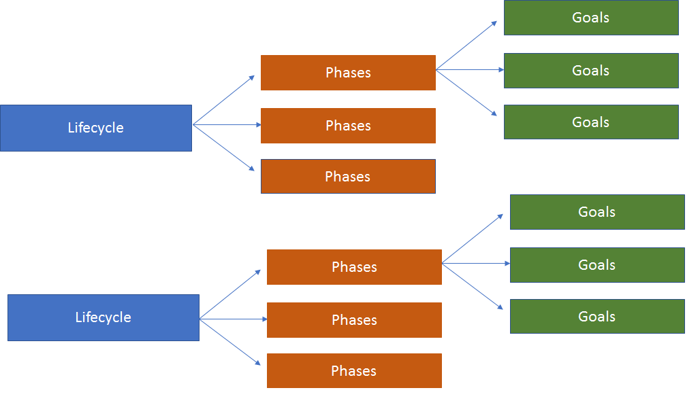
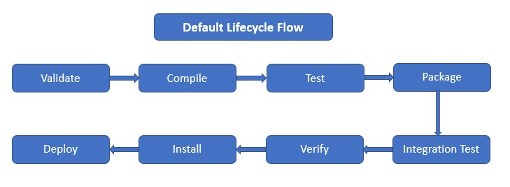

+++ 
draft = true
date = 2024-01-07T21:43:28+03:00
title = "Maven (.pom)"
description = ""
slug = ""
authors = ["Никита Гармоза"]
tags = []
categories = []
externalLink = ""
series = []
+++

**Maven** - автоматизированный сборщик проектов, выполняющий такие цели как

- Компиляция кода
- Запуск тестов
- Импортирование зависимостей
- Создания файлов запуска программы
- Унификация сборки (приведение к одному стандарту всего того, что выше)

Maven - является **декларативным** - разработчик только сообщает, что он хочет видеть в результате, но не как добиться этого. Как собрать проект и разрешить зависимости Maven решает сам (точнее с самого начала работает по общему шаблону). Благодаря этому **местоположение исходных и собранных файлов в проекте зафиксировано**

### Структура проекта

- `pom.xml` (project object model) - содержит всю конфигурацию необходимую для сборки проекта

- `{user}/.m2/` - местоположение Maven на локальной машине

- `/target` - файлы, полученные в результате сборки (выполняемые файлы, скомпилированные классы, отчеты тестов и другое)

- `artifact` - выполняемый **jar/war/ear** файл (хранится внутри `/target`)

- `/src/main/java` - основной код программы

- `/src/test/java` - тестовый код программы

### Структура pom.xml

#### Общая schema, версии разметки для pom.xml

```xml
<?xml version="1.0" encoding="UTF-8"?>
<project xmlns="http://maven.apache.org/POM/4.0.0"
         xmlns:xsi="http://www.w3.org/2001/XMLSchema-instance"
         xsi:schemaLocation="http://maven.apache.org/POM/4.0.0 http://maven.apache.org/xsd/maven-4.0.0.xsd">
    <modelVersion>4.0.0</modelVersion>

    <!-- code -->
</project>
```

#### Координаты проекта

```xml
<groupId>com.garmoza</groupId>
<artifactId>example</artifactId>
<version>1.0-SNAPSHOT</version>
```

`groupId` - имя, объединяющие несколько проектов. Чаще всего сайт, но может быть любым

`artifactId` - уникальное имя проекта

`version` - версия проекта

- `1.0-SNAPSHOT` - snapshot version - обновляется автоматически (для проекта в стадии активной разработки - до релиза)
- `1.0` - release version - требует изменения вручную

#### Исполняемый файл, получаемый в результате сборки

```xml
<packaging>jar</packaging>
```

- `jar` - java archive
- `war` - web archive
- `ear` - enterprise archive
- `pom` - project object model

#### Дополнительная информация о проекте

```xml
<name>Maven basic project</name>
<description>Project for the maven learning</description>
<url>https://example.com</url>
```

#### Properties

```xml
<properties>
    <maven.compiler.source>17</maven.compiler.source>
    <maven.compiler.target>17</maven.compiler.target>
    <project.build.sourceEncoding>UTF-8</project.build.sourceEncoding>

    <junit.version>4.13.2</junit.version>
</properties>
```

Обычно используется для указания **версий зависимостей, версии SDK**

#### Repositories

```xml
<repositories>
    <repository>
        <snapshots>
            <enabled>false</enabled>
        </snapshots>
        <id>central</id>
        <name>bintray</name>
        <url>https://jcenter.bintray.com</url>
    </repository>

    <repository>
        <!-- another repository -->
    </repository>
</repositories>
```

Места, откуда подгружаются зависимости. По умолчанию (если ничего не указанно) используется **maven central repository**,
который определяется в родительском pom.xml

#### Dependencies

```xml
<dependencies>
    <dependency>
        <groupId>junit</groupId>
        <artifactId>junit</artifactId>
        <version>${junit.version}</version>
        <scope>test</scope>
    </dependency>

    <dependency>
        <!-- another dependency -->
    </dependency>
</dependencies>
```

Для каждой зависимости указывается `groupId`, `artifactId`, `version`

#### Dependency scope

- `compile` - (default) code compilation + runtime + test
- `provided` - code compilation + test (lombok)
- `runtime` - runtime + test (jdbc)
- `test` - test (compile and runtime of tests)

### Maven lifecycle

В Maven есть возможность запускать

- целые жизненные циклы
- только единичные фазы
- только выбранные цели



По умолчанию в каждом Maven проекте три жизненных цикла (последовательности фаз):

- `site` - создает веб-сайт с информацией о проекте
- `clean` - удаляет /target
- `default` - основной жизненный цикл, содержит более чем 20 фаз



- `compile` - компилирует исходный код (преобразовывает .java в .class и помещает в /target)
- `test-compile` - аналогичен `compile`, только для test папки
- `test` - запускает тесты
- `package` - собирает файлы в jar/war/ear
- `install` - располагает выполняемые файлы локально
- `deploy` - копирует исполняемые файлы в удаленный репозиторий

#### Запуск циклов или фаз

```bash
mvn site
mvn clean
mvn clean site
```

Есть возможность пропускать фазы. Например, пропуск тестов

```bash
mvn package -D maven.test.skip=true
mvn package -D skipTests
```

#### Запуск целей

```bash
mvn name_of_plugin:goal
mvn resources:resources
mvn surefire:test
mvn compiler:compile
```

Каждая цель принадлежит некоторому плагину

#### Plugins

```xml
<build>
    <plugins>
        <plugin>
            <groupId>org.apache.maven.plugins</groupId>
            <artifactId>maven-compiler-plugin</artifactId>
            <version>3.11.0</version>
            <configuration>
                <source>1.8</source>
                <target>1.8</target>
            </configuration>
        </plugin>

        <plugin>
            <!-- another plugin -->
        </plugin>
    </plugins>
</build>
```

Можно добавлять новые плагины, конфигурировать их, а также **перезаписывать конфигурацию** для уже существующих

Либо можно вызывать цель вместе с флагом

```bash
mvn compiler:compile -D maven.compiler.target=1.8
```

#### Profiles

Maven profile - набор конфигураций, который может быть применен к проекту

```xml
<profiles>
    <profile>
        <id>production</id>
        <build>
            <directory>production</directory>
        </build>
    </profile>

    <profile>
        <id>changeFinalName</id>
        <build>
            <finalName>NewFinalName</finalName>
        </build>

        <activation>
            <activeByDefault>true</activeByDefault>
        </activation>
    </profile>
</profiles>
```

`activation` - задает условие, при котором будет применен профиль

- `activeByDefault` - применять всегда
- `property` - если указано свойство
- `file` - если указанный файл существует
- `jdk` - при совпадении версии jdk
- `os` - при указанной ОС

Вызов цели вместе с профилем

```bash
mvn -P production package
```
